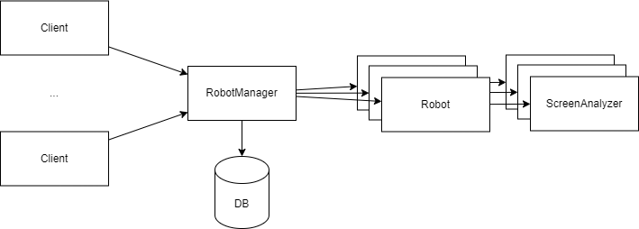

# RPA

Кейс RPA (Роботизация процессов автоматизации) направлен на решение задач, связанных с автоматизацией рутинных и сложно автоматизируемых повторяющихся операций, которые обычно выполняются сотрудниками. Функционал RPA необходим для того, чтобы заменить человеческую работу в таких задачах, как открытие desktop приложений, веб-страниц, заполнение форм, нажатие кнопок и копирование файлов.

Реализация функционала RPA позволит освободить сотрудников от выполнения монотонных и времeзатратных задач, обеспечивая при этом большую точность и эффективность в работе. Роботы RPA могут автоматически выполнять задачи, которые ранее требовали человеческого вмешательства, и это помогает компании сэкономить время, сократить возможные ошибки и повысить общую эффективность работы.

## Требования к роботу

***Под блоком понимается некоторый элемент GUI (поле ввода, кнопка, и т.д.). Для начальной версии робота блок будет определяться как область экрана приложения, ограниченная рамками, или область, которая может быть ими ограничена (например, текст).***

1. Поддержка действий:
    * С экраном => разбиение на именованные блоки для дальнейшего взаимодействия с ними; прокрутка экрана приложения; смена активного приложения; ЛКМ/ПКМ в точку;
    * С блоками => копирование текстового содержимого при наличии, нажатие на выделенные блоки (button, radio-button, etc)
    * С полями ввода => изменение и копирование содержимого
    * С выводами (файлами/видео/выводами) => возврат их как результат работы, передача между приложениями в рамках сценария.
    * Ожидания во времени
    
2. Объявление императивного языка для описания сценариев на основе заданных действий.
    * Введение глобальных переменных
    * Введение управляющих конструкций (циклов и ветвлений)

3. Проверка синтаксической корректности введенного сценария.
4. Выполнение переданной команды (скрипта) и возврат текущего состояния (скрин экрана / вывод)
5. Покадровая запись выполняемого сценария
6. API для взаимодействия с роботом

## Требования к системе

1. Интерактивный ввод сценариев (пошаговое сопровождение робота)
2. Ввод сценариев в виде скрипта.
3. Ролевая модель доступа к RPA
    * administrator -- создание и редактирование сценариев. Выдача прав группам пользователей на выполнение сценариев. Выдача прав администраторам на их редактирование.
    * user -- выполнение доступных сценариев.
4. Выполнение сохраненных сценариев. Просмотр хода выполнения запущенных сценариев.
5. Версионирование роботов
6. Web-приложение для создания и управления сценариями.
7. API для взаимодействия с системой.

**Опциональные**

1. Инициализация сценария на основе видео с записанными пользовательскими действиями

## Примерный вид системы

